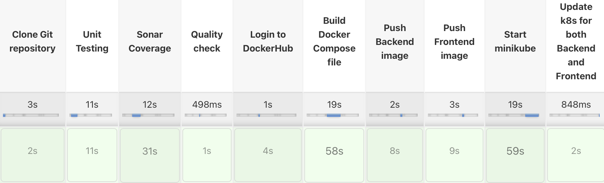

# Table of Contents

1. [Final Project](#final-project)
2. [Unit test](#unit-test)
3. [Sonarqube](#sonarqube)
4. [Kubernetes](#kubernetes)
5. [Jenkins](#jenkins)

# Final Project

It is the source code of my final project at ABB - Software Engineering 2 course.

The main goal of this project was to develop a unit test for the application that we have created on the step project, using Sonarqube to get line coverage, deploying the application using Kubernetes, and automating the process with the Jenkins pipeline.

# Unit test
In order to carry out unit test I have wrote 11 test. As you can see all of these tests passed succesfully.

  

# Sonarqube
I have download Sonarqube server to my local machine. Then after following the steps I got following result:

  

# Kubernetes
I have created deployment and service file for both my backend and frontend inside the k8s folder. After creating file first i have started my minikube cluster.

  

Then I have applied my deployment and service files for backend and frontend
 
 

  

  

After those steps my pods are like this:

  

Kubectl services:

  

Kubectl namespaces:

  

Now let's get minikube cluster ip for frontend
 

  

When we click the IP we get our front-end app:

  

  

My Minikube dashboard:

  

# Jenkins
I have created Jenkinsfile in order to automate process.  
My Jenkins pipeline output is like following:

  

My Sonarqube quality gate:

  

